# NonBScanner Visual Flowcharts and Diagrams

This document contains interactive flowcharts and diagrams for the NonBScanner tool using Mermaid syntax. These diagrams can be rendered in GitHub, GitLab, and most modern markdown viewers.

---

## 1. System Architecture Diagram

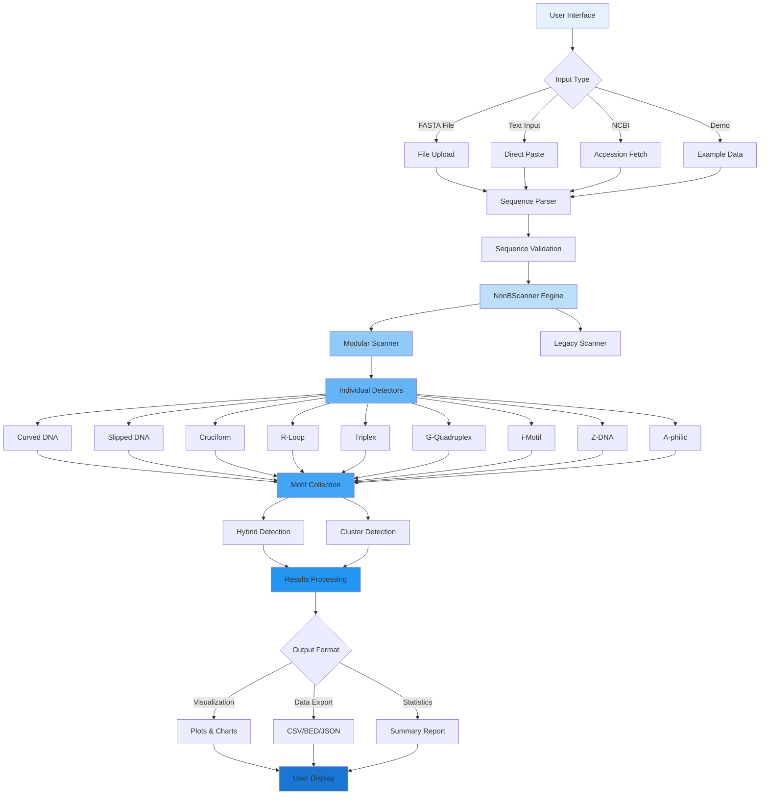
```mermaid
graph TB
    A[User Interface] --> B{Input Type}
    B -->|FASTA File| C[File Upload]
    B -->|Text Input| D[Direct Paste]
    B -->|NCBI| E[Accession Fetch]
    B -->|Demo| F[Example Data]
    
    C --> G[Sequence Parser]
    D --> G
    E --> G
    F --> G
    
    G --> H[Sequence Validation]
    H --> I[NonBScanner Engine]
    
    I --> J[Modular Scanner]
    I --> K[Legacy Scanner]
    
    J --> L[Individual Detectors]
    L --> L1[Curved DNA]
    L --> L2[Slipped DNA]
    L --> L3[Cruciform]
    L --> L4[R-Loop]
    L --> L5[Triplex]
    L --> L6[G-Quadruplex]
    L --> L7[i-Motif]
    L --> L8[Z-DNA]
    L --> L9[A-philic]
    
    L1 --> M[Motif Collection]
    L2 --> M
    L3 --> M
    L4 --> M
    L5 --> M
    L6 --> M
    L7 --> M
    L8 --> M
    L9 --> M
    
    M --> N[Hybrid Detection]
    M --> O[Cluster Detection]
    
    N --> P[Results Processing]
    O --> P
    
    P --> Q{Output Format}
    Q -->|Visualization| R[Plots & Charts]
    Q -->|Data Export| S[CSV/BED/JSON]
    Q -->|Statistics| T[Summary Report]
    
    R --> U[User Display]
    S --> U
    T --> U
    
    style A fill:#e3f2fd
    style I fill:#bbdefb
    style J fill:#90caf9
    style L fill:#64b5f6
    style M fill:#42a5f5
    style P fill:#2196f3
    style U fill:#1976d2
```

---

## 2. Detection Pipeline Flowchart

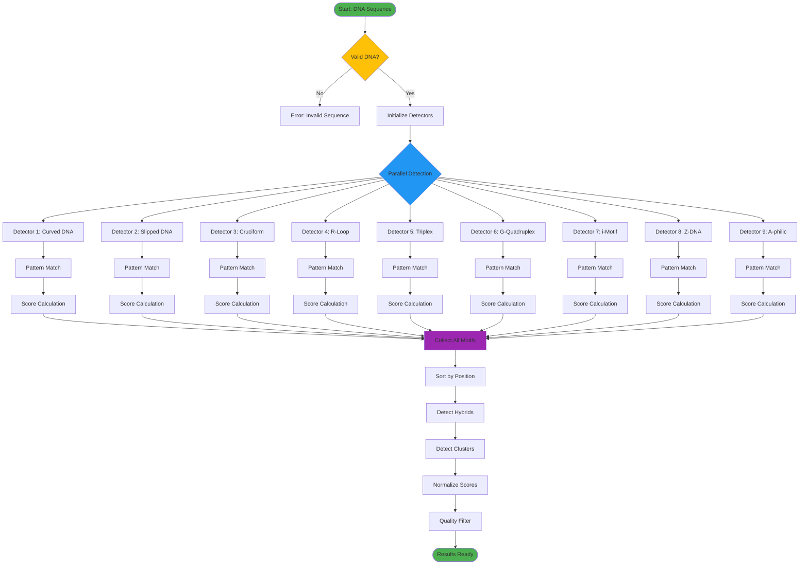
```mermaid
flowchart TD
    Start([Start: DNA Sequence]) --> Validate{Valid DNA?}
    
    Validate -->|No| Error[Error: Invalid Sequence]
    Validate -->|Yes| Init[Initialize Detectors]
    
    Init --> Parallel{Parallel Detection}
    
    Parallel --> D1[Detector 1: Curved DNA]
    Parallel --> D2[Detector 2: Slipped DNA]
    Parallel --> D3[Detector 3: Cruciform]
    Parallel --> D4[Detector 4: R-Loop]
    Parallel --> D5[Detector 5: Triplex]
    Parallel --> D6[Detector 6: G-Quadruplex]
    Parallel --> D7[Detector 7: i-Motif]
    Parallel --> D8[Detector 8: Z-DNA]
    Parallel --> D9[Detector 9: A-philic]
    
    D1 --> P1[Pattern Match]
    D2 --> P2[Pattern Match]
    D3 --> P3[Pattern Match]
    D4 --> P4[Pattern Match]
    D5 --> P5[Pattern Match]
    D6 --> P6[Pattern Match]
    D7 --> P7[Pattern Match]
    D8 --> P8[Pattern Match]
    D9 --> P9[Pattern Match]
    
    P1 --> S1[Score Calculation]
    P2 --> S2[Score Calculation]
    P3 --> S3[Score Calculation]
    P4 --> S4[Score Calculation]
    P5 --> S5[Score Calculation]
    P6 --> S6[Score Calculation]
    P7 --> S7[Score Calculation]
    P8 --> S8[Score Calculation]
    P9 --> S9[Score Calculation]
    
    S1 --> Collect[Collect All Motifs]
    S2 --> Collect
    S3 --> Collect
    S4 --> Collect
    S5 --> Collect
    S6 --> Collect
    S7 --> Collect
    S8 --> Collect
    S9 --> Collect
    
    Collect --> Sort[Sort by Position]
    Sort --> Hybrid[Detect Hybrids]
    Hybrid --> Cluster[Detect Clusters]
    Cluster --> Normalize[Normalize Scores]
    Normalize --> Filter[Quality Filter]
    Filter --> End([Results Ready])
    
    style Start fill:#4caf50
    style Validate fill:#ffc107
    style Parallel fill:#2196f3
    style Collect fill:#9c27b0
    style End fill:#4caf50
```

---

## 3. Data Flow Diagram

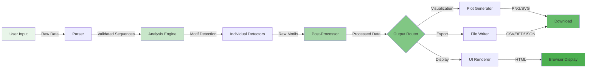
```mermaid
graph LR
    A[User Input] -->|Raw Data| B[Parser]
    B -->|Validated Sequences| C[Analysis Engine]
    
    C -->|Motif Detection| D[Individual Detectors]
    D -->|Raw Motifs| E[Post-Processor]
    
    E -->|Processed Data| F{Output Router}
    
    F -->|Visualization| G[Plot Generator]
    F -->|Export| H[File Writer]
    F -->|Display| I[UI Renderer]
    
    G -->|PNG/SVG| J[Download]
    H -->|CSV/BED/JSON| J
    I -->|HTML| K[Browser Display]
    
    style A fill:#e8f5e9
    style C fill:#c8e6c9
    style E fill:#a5d6a7
    style F fill:#81c784
    style J fill:#66bb6a
    style K fill:#4caf50
```

---

## 4. Motif Detection State Machine

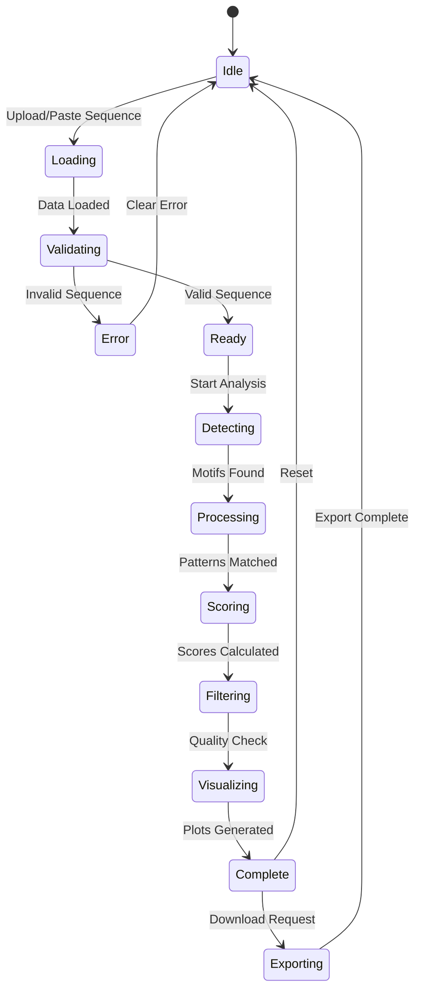
```mermaid
stateDiagram-v2
    [*] --> Idle
    Idle --> Loading: Upload/Paste Sequence
    Loading --> Validating: Data Loaded
    Validating --> Error: Invalid Sequence
    Validating --> Ready: Valid Sequence
    
    Ready --> Detecting: Start Analysis
    Detecting --> Processing: Motifs Found
    Processing --> Scoring: Patterns Matched
    Scoring --> Filtering: Scores Calculated
    Filtering --> Visualizing: Quality Check
    
    Visualizing --> Complete: Plots Generated
    Complete --> Idle: Reset
    Complete --> Exporting: Download Request
    Exporting --> Idle: Export Complete
    
    Error --> Idle: Clear Error
```

---

## 5. Class Hierarchy Diagram

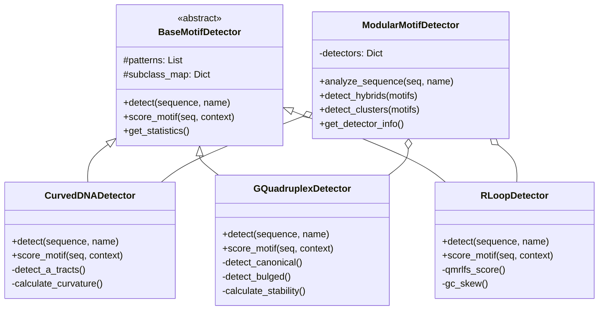
```mermaid
classDiagram
    class BaseMotifDetector {
        <<abstract>>
        +detect(sequence, name)
        +score_motif(seq, context)
        +get_statistics()
        #patterns: List
        #subclass_map: Dict
    }
    
    class CurvedDNADetector {
        +detect(sequence, name)
        +score_motif(seq, context)
        -detect_a_tracts()
        -calculate_curvature()
    }
    
    class GQuadruplexDetector {
        +detect(sequence, name)
        +score_motif(seq, context)
        -detect_canonical()
        -detect_bulged()
        -calculate_stability()
    }
    
    class RLoopDetector {
        +detect(sequence, name)
        +score_motif(seq, context)
        -qmrlfs_score()
        -gc_skew()
    }
    
    class ModularMotifDetector {
        -detectors: Dict
        +analyze_sequence(seq, name)
        +detect_hybrids(motifs)
        +detect_clusters(motifs)
        +get_detector_info()
    }
    
    BaseMotifDetector <|-- CurvedDNADetector
    BaseMotifDetector <|-- GQuadruplexDetector
    BaseMotifDetector <|-- RLoopDetector
    
    ModularMotifDetector o-- CurvedDNADetector
    ModularMotifDetector o-- GQuadruplexDetector
    ModularMotifDetector o-- RLoopDetector
```

---

## 6. Sequence Analysis Workflow

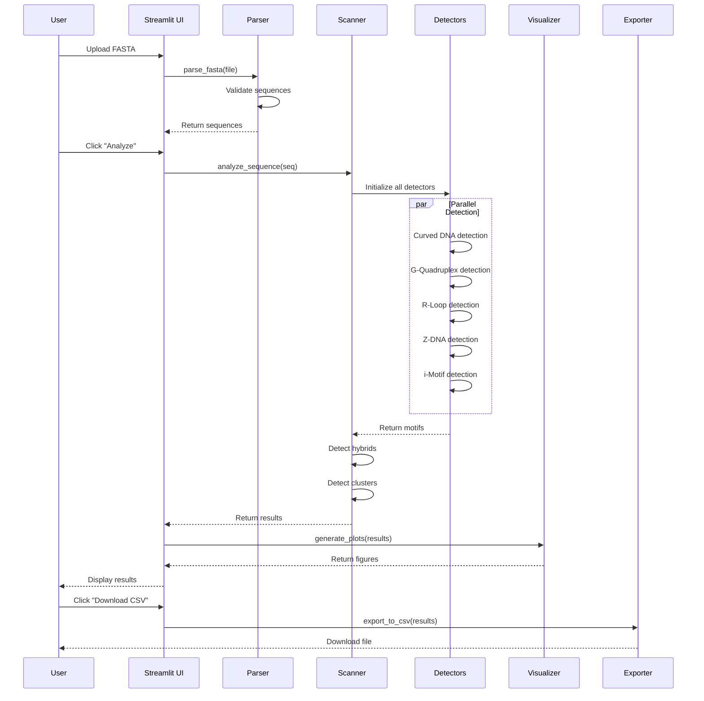
```mermaid
sequenceDiagram
    participant U as User
    participant UI as Streamlit UI
    participant P as Parser
    participant S as Scanner
    participant D as Detectors
    participant V as Visualizer
    participant E as Exporter
    
    U->>UI: Upload FASTA
    UI->>P: parse_fasta(file)
    P->>P: Validate sequences
    P-->>UI: Return sequences
    
    U->>UI: Click "Analyze"
    UI->>S: analyze_sequence(seq)
    S->>D: Initialize all detectors
    
    par Parallel Detection
        D->>D: Curved DNA detection
        D->>D: G-Quadruplex detection
        D->>D: R-Loop detection
        D->>D: Z-DNA detection
        D->>D: i-Motif detection
    end
    
    D-->>S: Return motifs
    S->>S: Detect hybrids
    S->>S: Detect clusters
    S-->>UI: Return results
    
    UI->>V: generate_plots(results)
    V-->>UI: Return figures
    UI-->>U: Display results
    
    U->>UI: Click "Download CSV"
    UI->>E: export_to_csv(results)
    E-->>U: Download file
```

---

## 7. Performance Optimization Decision Tree

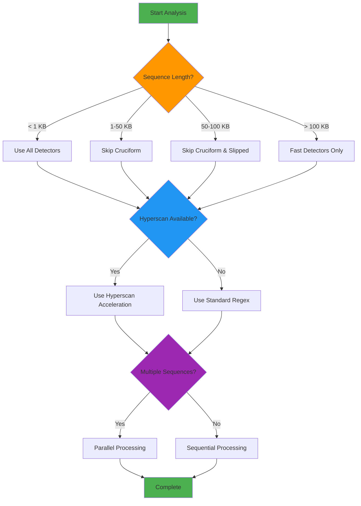
```mermaid
graph TD
    A[Start Analysis] --> B{Sequence Length?}
    
    B -->|< 1 KB| C[Use All Detectors]
    B -->|1-50 KB| D[Skip Cruciform]
    B -->|50-100 KB| E[Skip Cruciform & Slipped]
    B -->|> 100 KB| F[Fast Detectors Only]
    
    C --> G{Hyperscan Available?}
    D --> G
    E --> G
    F --> G
    
    G -->|Yes| H[Use Hyperscan Acceleration]
    G -->|No| I[Use Standard Regex]
    
    H --> J{Multiple Sequences?}
    I --> J
    
    J -->|Yes| K[Parallel Processing]
    J -->|No| L[Sequential Processing]
    
    K --> M[Complete]
    L --> M
    
    style A fill:#4caf50
    style B fill:#ff9800
    style G fill:#2196f3
    style J fill:#9c27b0
    style M fill:#4caf50
```

---

## 8. Module Dependency Graph

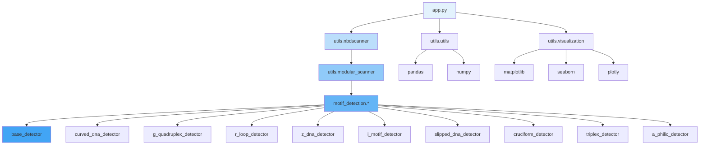
```mermaid
graph TB
    A[app.py] --> B[utils.nbdscanner]
    A --> C[utils.utils]
    A --> D[utils.visualization]
    
    B --> E[utils.modular_scanner]
    E --> F[motif_detection.*]
    
    F --> F1[base_detector]
    F --> F2[curved_dna_detector]
    F --> F3[g_quadruplex_detector]
    F --> F4[r_loop_detector]
    F --> F5[z_dna_detector]
    F --> F6[i_motif_detector]
    F --> F7[slipped_dna_detector]
    F --> F8[cruciform_detector]
    F --> F9[triplex_detector]
    F --> F10[a_philic_detector]
    
    C --> G[pandas]
    C --> H[numpy]
    D --> I[matplotlib]
    D --> J[seaborn]
    D --> K[plotly]
    
    style A fill:#e3f2fd
    style B fill:#bbdefb
    style E fill:#90caf9
    style F fill:#64b5f6
    style F1 fill:#42a5f5
```

---

## 9. Error Handling Flow

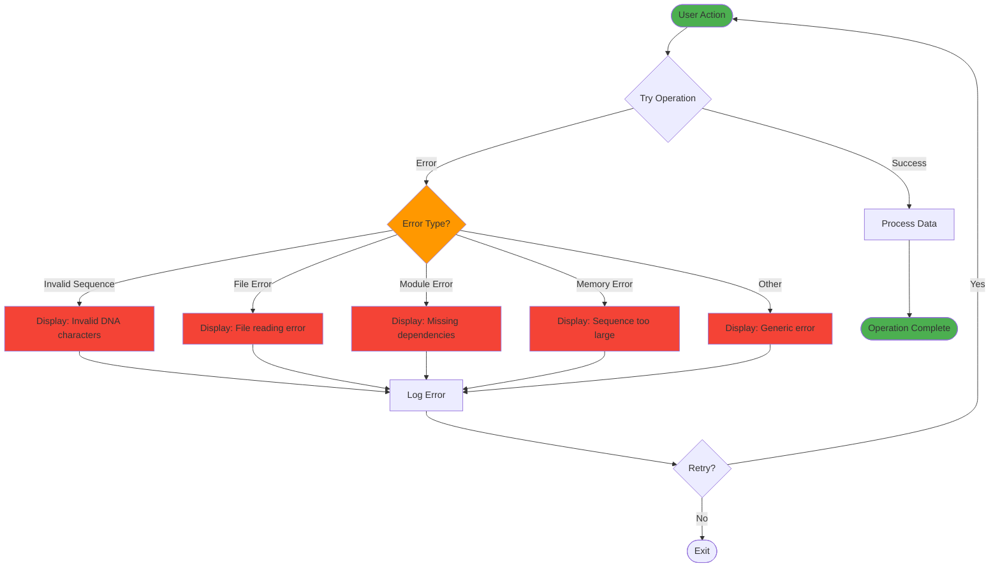
```mermaid
flowchart TD
    Start([User Action]) --> Try{Try Operation}
    
    Try -->|Success| Process[Process Data]
    Try -->|Error| Catch{Error Type?}
    
    Catch -->|Invalid Sequence| E1[Display: Invalid DNA characters]
    Catch -->|File Error| E2[Display: File reading error]
    Catch -->|Module Error| E3[Display: Missing dependencies]
    Catch -->|Memory Error| E4[Display: Sequence too large]
    Catch -->|Other| E5[Display: Generic error]
    
    E1 --> Log[Log Error]
    E2 --> Log
    E3 --> Log
    E4 --> Log
    E5 --> Log
    
    Process --> Success([Operation Complete])
    Log --> Retry{Retry?}
    
    Retry -->|Yes| Start
    Retry -->|No| End([Exit])
    
    style Start fill:#4caf50
    style Catch fill:#ff9800
    style E1 fill:#f44336
    style E2 fill:#f44336
    style E3 fill:#f44336
    style E4 fill:#f44336
    style E5 fill:#f44336
    style Success fill:#4caf50
```

---

## 10. Export Pipeline

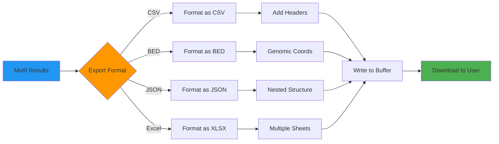
```mermaid
flowchart LR
    A[Motif Results] --> B{Export Format}
    
    B -->|CSV| C[Format as CSV]
    B -->|BED| D[Format as BED]
    B -->|JSON| E[Format as JSON]
    B -->|Excel| F[Format as XLSX]
    
    C --> G[Add Headers]
    D --> H[Genomic Coords]
    E --> I[Nested Structure]
    F --> J[Multiple Sheets]
    
    G --> K[Write to Buffer]
    H --> K
    I --> K
    J --> K
    
    K --> L[Download to User]
    
    style A fill:#2196f3
    style B fill:#ff9800
    style L fill:#4caf50
```

---

## 11. Hybrid & Cluster Detection

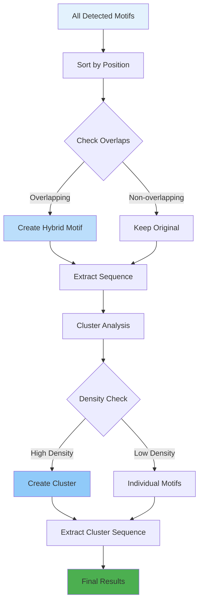
```mermaid
graph TD
    A[All Detected Motifs] --> B[Sort by Position]
    B --> C{Check Overlaps}
    
    C -->|Overlapping| D[Create Hybrid Motif]
    C -->|Non-overlapping| E[Keep Original]
    
    D --> F[Extract Sequence]
    E --> F
    
    F --> G[Cluster Analysis]
    G --> H{Density Check}
    
    H -->|High Density| I[Create Cluster]
    H -->|Low Density| J[Individual Motifs]
    
    I --> K[Extract Cluster Sequence]
    J --> K
    
    K --> L[Final Results]
    
    style A fill:#e3f2fd
    style D fill:#bbdefb
    style I fill:#90caf9
    style L fill:#4caf50
```

---

## 12. Visualization Generation Process

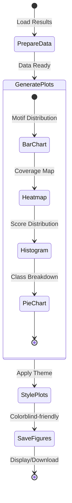
```mermaid
stateDiagram-v2
    [*] --> PrepareData: Load Results
    PrepareData --> GeneratePlots: Data Ready
    
    state GeneratePlots {
        [*] --> BarChart: Motif Distribution
        BarChart --> Heatmap: Coverage Map
        Heatmap --> Histogram: Score Distribution
        Histogram --> PieChart: Class Breakdown
        PieChart --> [*]
    }
    
    GeneratePlots --> StylePlots: Apply Theme
    StylePlots --> SaveFigures: Colorblind-friendly
    SaveFigures --> [*]: Display/Download
```

---

## 13. User Session Flow

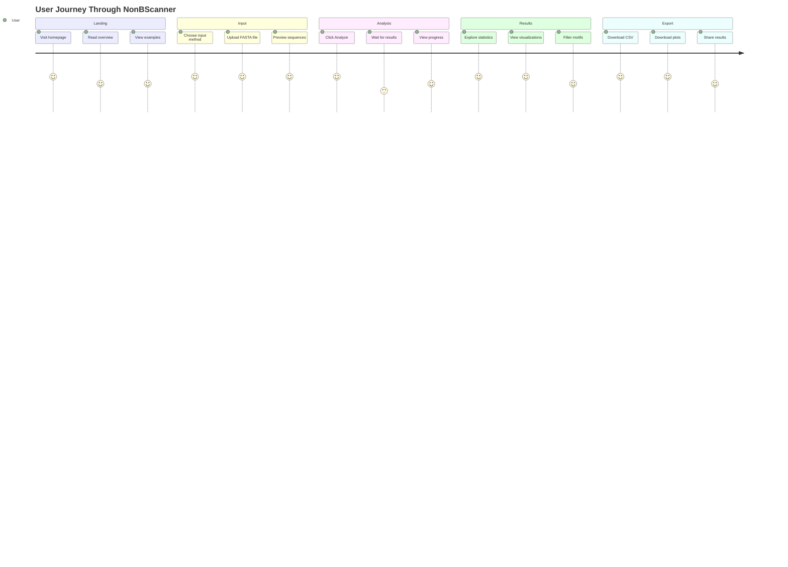
```mermaid
journey
    title User Journey Through NonBScanner
    section Landing
      Visit homepage: 5: User
      Read overview: 4: User
      View examples: 4: User
    section Input
      Choose input method: 5: User
      Upload FASTA file: 5: User
      Preview sequences: 5: User
    section Analysis
      Click Analyze: 5: User
      Wait for results: 3: User
      View progress: 4: User
    section Results
      Explore statistics: 5: User
      View visualizations: 5: User
      Filter motifs: 4: User
    section Export
      Download CSV: 5: User
      Download plots: 5: User
      Share results: 4: User
```

---

## 14. Memory Management Strategy

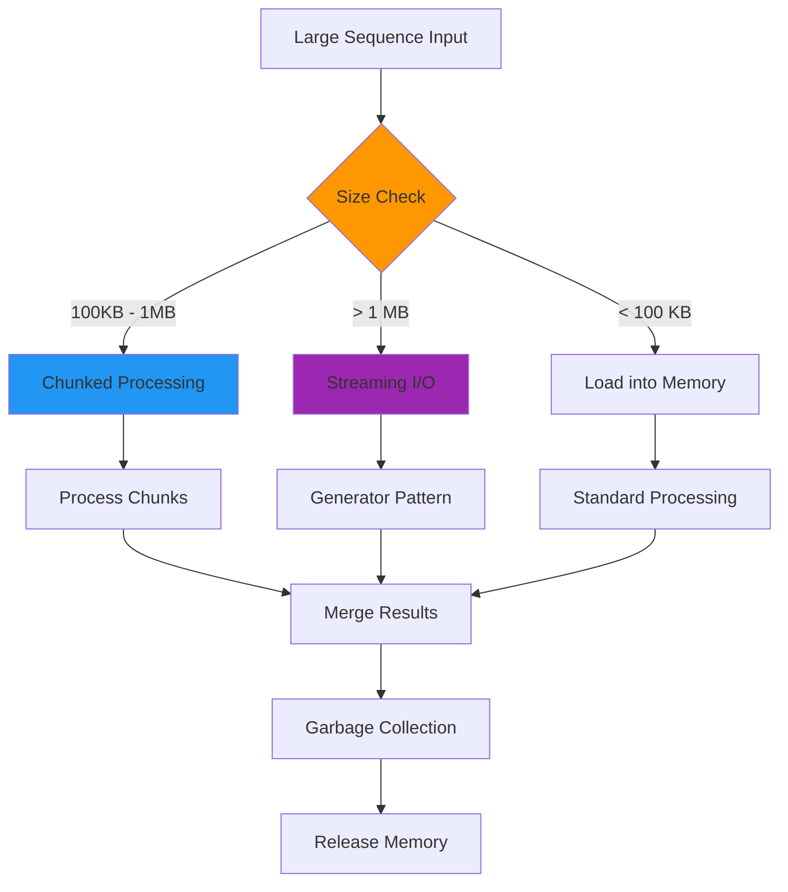
```mermaid
graph TB
    A[Large Sequence Input] --> B{Size Check}
    
    B -->|< 100 KB| C[Load into Memory]
    B -->|100KB - 1MB| D[Chunked Processing]
    B -->|> 1 MB| E[Streaming I/O]
    
    C --> F[Standard Processing]
    D --> G[Process Chunks]
    E --> H[Generator Pattern]
    
    G --> I[Merge Results]
    H --> I
    F --> I
    
    I --> J[Garbage Collection]
    J --> K[Release Memory]
    
    style B fill:#ff9800
    style D fill:#2196f3
    style E fill:#9c27b0
```

---

## 15. Quality Control Pipeline

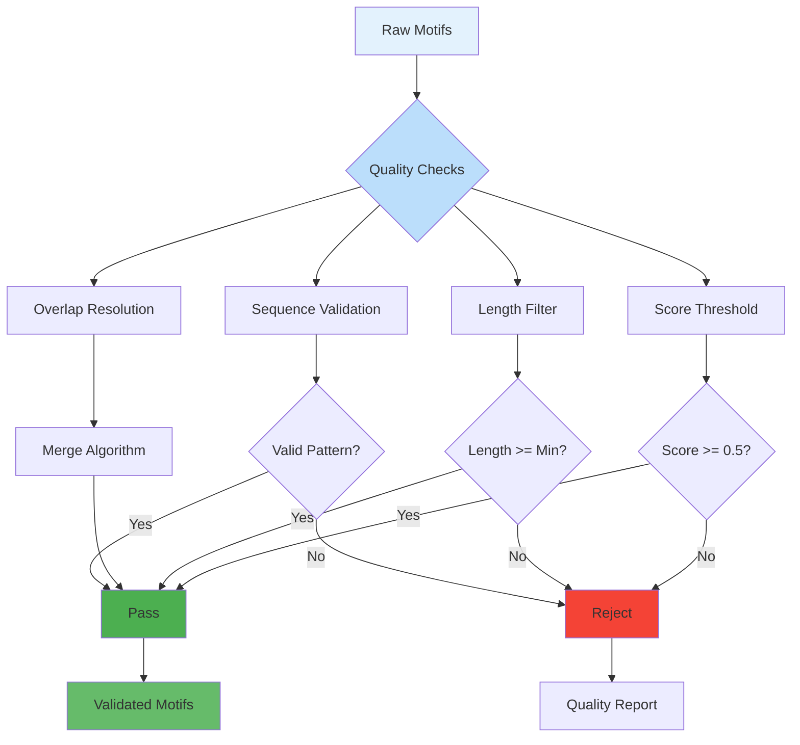
```mermaid
flowchart TD
    A[Raw Motifs] --> B{Quality Checks}
    
    B --> C[Score Threshold]
    B --> D[Length Filter]
    B --> E[Overlap Resolution]
    B --> F[Sequence Validation]
    
    C --> G{Score >= 0.5?}
    G -->|Yes| H[Pass]
    G -->|No| I[Reject]
    
    D --> J{Length >= Min?}
    J -->|Yes| H
    J -->|No| I
    
    E --> K[Merge Algorithm]
    K --> H
    
    F --> L{Valid Pattern?}
    L -->|Yes| H
    L -->|No| I
    
    H --> M[Validated Motifs]
    I --> N[Quality Report]
    
    style A fill:#e3f2fd
    style B fill:#bbdefb
    style H fill:#4caf50
    style I fill:#f44336
    style M fill:#66bb6a
```

---

## 16. Multi-Sequence Batch Processing

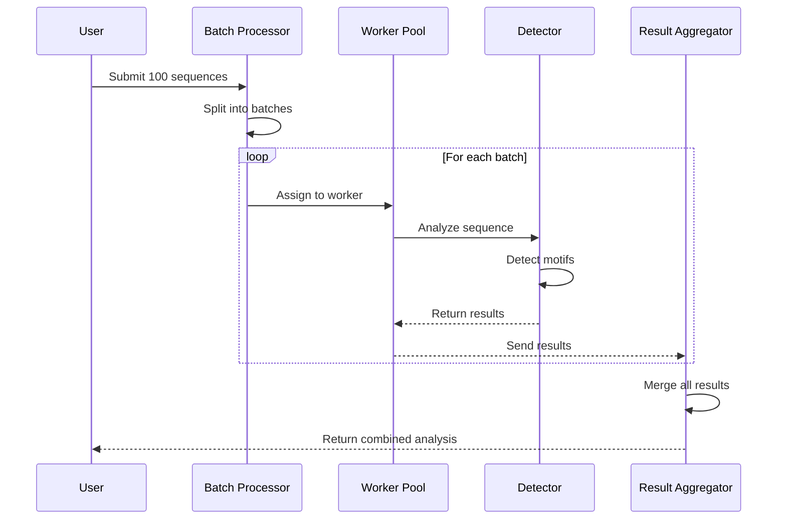
```mermaid
sequenceDiagram
    participant U as User
    participant B as Batch Processor
    participant W as Worker Pool
    participant D as Detector
    participant R as Result Aggregator
    
    U->>B: Submit 100 sequences
    B->>B: Split into batches
    
    loop For each batch
        B->>W: Assign to worker
        W->>D: Analyze sequence
        D->>D: Detect motifs
        D-->>W: Return results
        W-->>R: Send results
    end
    
    R->>R: Merge all results
    R-->>U: Return combined analysis
```

---

## 17. Configuration Flow

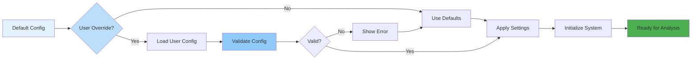
```mermaid
graph LR
    A[Default Config] --> B{User Override?}
    
    B -->|Yes| C[Load User Config]
    B -->|No| D[Use Defaults]
    
    C --> E[Validate Config]
    D --> F[Apply Settings]
    
    E --> G{Valid?}
    G -->|Yes| F
    G -->|No| H[Show Error]
    
    H --> D
    
    F --> I[Initialize System]
    I --> J[Ready for Analysis]
    
    style A fill:#e3f2fd
    style B fill:#bbdefb
    style E fill:#90caf9
    style J fill:#4caf50
```

---

## 18. Real-time Progress Tracking

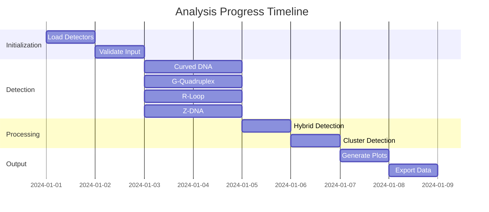
```mermaid
gantt
    title Analysis Progress Timeline
    dateFormat YYYY-MM-DD
    section Initialization
    Load Detectors       :a1, 2024-01-01, 1d
    Validate Input       :a2, after a1, 1d
    section Detection
    Curved DNA          :b1, after a2, 2d
    G-Quadruplex        :b2, after a2, 2d
    R-Loop              :b3, after a2, 2d
    Z-DNA               :b4, after a2, 2d
    section Processing
    Hybrid Detection    :c1, after b1, 1d
    Cluster Detection   :c2, after c1, 1d
    section Output
    Generate Plots      :d1, after c2, 1d
    Export Data         :d2, after d1, 1d
```

---

## 19. API Call Flow

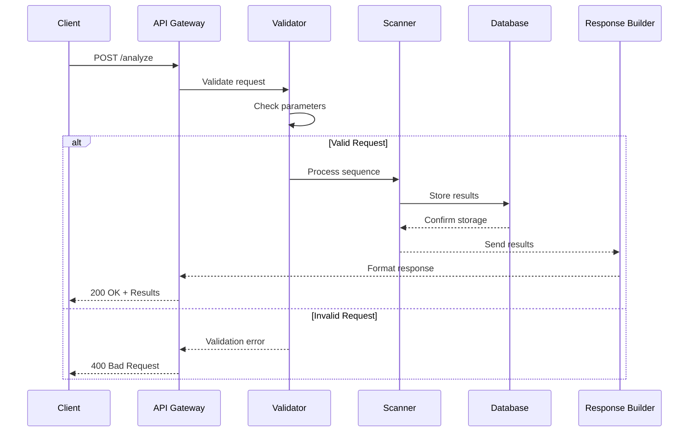
```mermaid
sequenceDiagram
    participant C as Client
    participant A as API Gateway
    participant V as Validator
    participant S as Scanner
    participant D as Database
    participant R as Response Builder
    
    C->>A: POST /analyze
    A->>V: Validate request
    V->>V: Check parameters
    
    alt Valid Request
        V->>S: Process sequence
        S->>D: Store results
        D-->>S: Confirm storage
        S-->>R: Send results
        R-->>A: Format response
        A-->>C: 200 OK + Results
    else Invalid Request
        V-->>A: Validation error
        A-->>C: 400 Bad Request
    end
```

---

## 20. Deployment Architecture

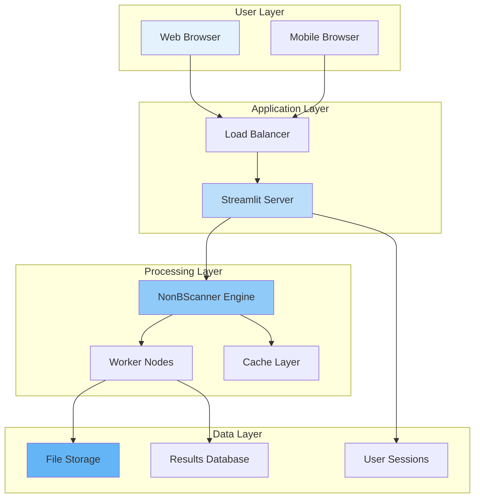
```mermaid
graph TB
    subgraph "User Layer"
        A[Web Browser]
        B[Mobile Browser]
    end
    
    subgraph "Application Layer"
        C[Streamlit Server]
        D[Load Balancer]
    end
    
    subgraph "Processing Layer"
        E[NonBScanner Engine]
        F[Worker Nodes]
        G[Cache Layer]
    end
    
    subgraph "Data Layer"
        H[File Storage]
        I[Results Database]
        J[User Sessions]
    end
    
    A --> D
    B --> D
    D --> C
    C --> E
    E --> F
    E --> G
    F --> H
    F --> I
    C --> J
    
    style A fill:#e3f2fd
    style C fill:#bbdefb
    style E fill:#90caf9
    style H fill:#64b5f6
```

---

**Document Information:**
- **Purpose:** Visual representation of NonBScanner workflows
- **Format:** Mermaid diagrams (GitHub/GitLab compatible)
- **Rendering:** View in GitHub README or compatible markdown viewers
- **Last Updated:** October 2024

