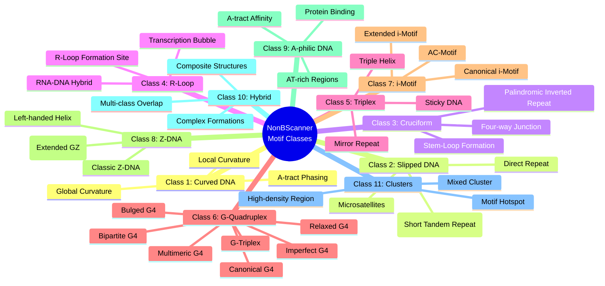
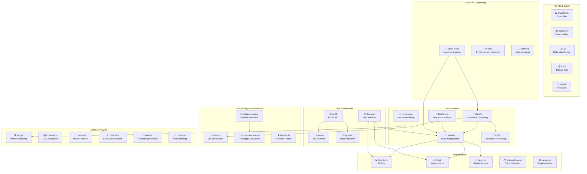
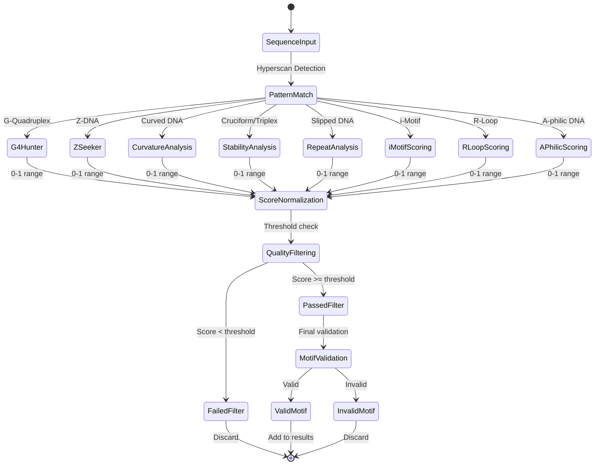
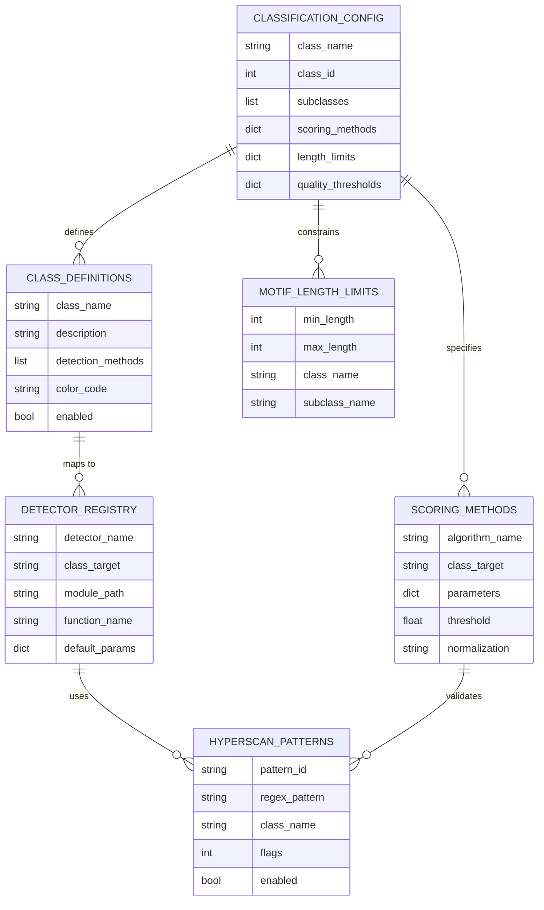
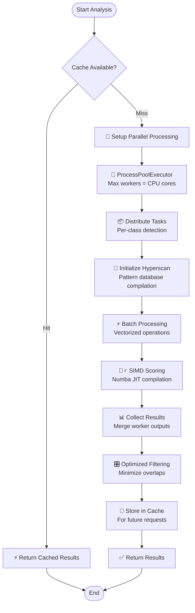

# 🧬 NonBScanner Detailed Component Diagrams

## 📋 Table of Contents
1. [Motif Detection Classes Hierarchy](#motif-detection-classes-hierarchy)
2. [Hyperscan Pattern Matching Flow](#hyperscan-pattern-matching-flow)
3. [Visualization Pipeline](#visualization-pipeline)
4. [Function & Library Dependencies](#function--library-dependencies)
5. [Scoring Algorithm Workflow](#scoring-algorithm-workflow)
6. [Configuration & Class Management](#configuration--class-management)

## 🗂️ Motif Detection Classes Hierarchy

## ⚡ Hyperscan Pattern Matching Flow

```mermaid
flowchart LR
    subgraph "Pattern Registry"
        REGEX_REG[🔍 Regex Registry<br/>core/regex_registry.py]
        PATTERNS[📝 Pattern Definitions<br/>Class-specific regex]
        COMPILE[⚙️ Pattern Compilation<br/>Hyperscan format]
    end
    
    subgraph "Hyperscan Engine"
        HS_DB[🚀 Hyperscan Database<br/>Compiled patterns]
        HS_SCAN[⚡ Fast Scanning<br/>Intel SSE/AVX]
        HS_MATCH[🎯 Match Callback<br/>Position tracking]
    end
    
    subgraph "Post-Processing"
        VALIDATE_MATCH[✅ Match Validation<br/>Length, context checks]
        SCORE_CALC[📊 Score Calculation<br/>Class-specific algorithms]
        QUALITY_FILTER[🎛️ Quality Filter<br/>Threshold application]
    end
    
    REGEX_REG --> PATTERNS
    PATTERNS --> COMPILE
    COMPILE --> HS_DB
    
    HS_DB --> HS_SCAN
    HS_SCAN --> HS_MATCH
    
    HS_MATCH --> VALIDATE_MATCH
    VALIDATE_MATCH --> SCORE_CALC
    SCORE_CALC --> QUALITY_FILTER
    
    QUALITY_FILTER --> RESULTS[📋 Motif Results]
```

## 📈 Visualization Pipeline

```mermaid
graph TD
    subgraph "Input Data"
        MOTIF_DATA[🧬 Motif Detection Results]
        SEQ_DATA[📄 Sequence Information]
        STATS_DATA[📊 Statistical Data]
    end
    
    subgraph "Plotting Engines"
        MATPLOTLIB[📊 Matplotlib<br/>Static plots]
        PLOTLY[📈 Plotly<br/>Interactive plots]
        SEABORN[🎨 Seaborn<br/>Statistical plots]
    end
    
    subgraph "Chart Types"
        DIST[📊 Distribution Plots<br/>Motif counts, lengths]
        HEAT[🔥 Heatmaps<br/>Position matrices]
        TRACK[📍 Track Plots<br/>Genome browser style]
        SUNBURST[☀️ Sunburst<br/>Hierarchical data]
        NETWORK[🕸️ Network<br/>Motif interactions]
        SCATTER[📈 Scatter<br/>Score correlations]
        BOX[📦 Box Plots<br/>Score distributions]
        VIOLIN[🎻 Violin Plots<br/>Density curves]
        MANHATTAN[🏙️ Manhattan<br/>Position-score plot]
        TSNE[🧬 t-SNE<br/>Dimensionality reduction]
        TREEMAP[🌳 Treemap<br/>Hierarchical proportions]
    end
    
    subgraph "Export Formats"
        PNG[🖼️ PNG/JPEG<br/>Static images]
        SVG[📐 SVG<br/>Vector graphics]
        HTML[🌐 HTML<br/>Interactive plots]
        PDF[📄 PDF<br/>Publication quality]
    end
    
    subgraph "Browser Integration"
        UCSC[🌍 UCSC Hub<br/>Track hub creation]
        IGV[🔬 IGV Session<br/>Session files]
        JBROWSE[🧬 JBrowse<br/>Config generation]
        BIGWIG[📊 BigWig<br/>Signal tracks]
        BED[📋 BED<br/>Feature annotation]
    end
    
    MOTIF_DATA --> MATPLOTLIB
    SEQ_DATA --> MATPLOTLIB
    STATS_DATA --> MATPLOTLIB
    
    MOTIF_DATA --> PLOTLY
    SEQ_DATA --> PLOTLY
    STATS_DATA --> PLOTLY
    
    MOTIF_DATA --> SEABORN
    STATS_DATA --> SEABORN
    
    MATPLOTLIB --> DIST
    MATPLOTLIB --> HEAT
    MATPLOTLIB --> BOX
    MATPLOTLIB --> VIOLIN
    
    PLOTLY --> TRACK
    PLOTLY --> SUNBURST
    PLOTLY --> NETWORK
    PLOTLY --> SCATTER
    PLOTLY --> MANHATTAN
    PLOTLY --> TREEMAP
    
    SEABORN --> TSNE
    
    DIST --> PNG
    HEAT --> PNG
    TRACK --> HTML
    SUNBURST --> HTML
    
    PNG --> PDF
    HTML --> SVG
    
    MOTIF_DATA --> UCSC
    MOTIF_DATA --> IGV
    MOTIF_DATA --> JBROWSE
    MOTIF_DATA --> BIGWIG
    MOTIF_DATA --> BED
```

## 🔧 Function & Library Dependencies

## ⚖️ Scoring Algorithm Workflow

## ⚙️ Configuration & Class Management

## 🚀 Performance Optimization Flow

This comprehensive documentation covers all major components, workflows, and interactions within the NonBScanner system, providing clear visual representations of the tool's architecture and functionality.