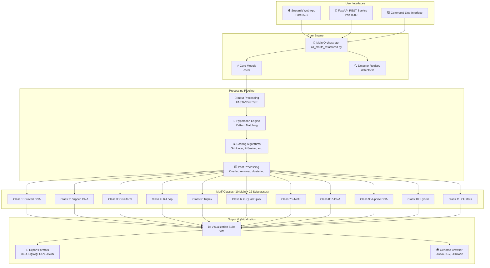
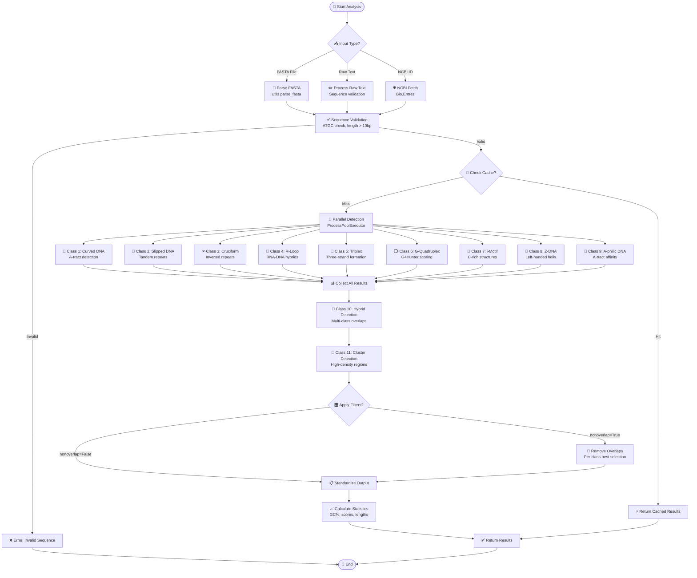
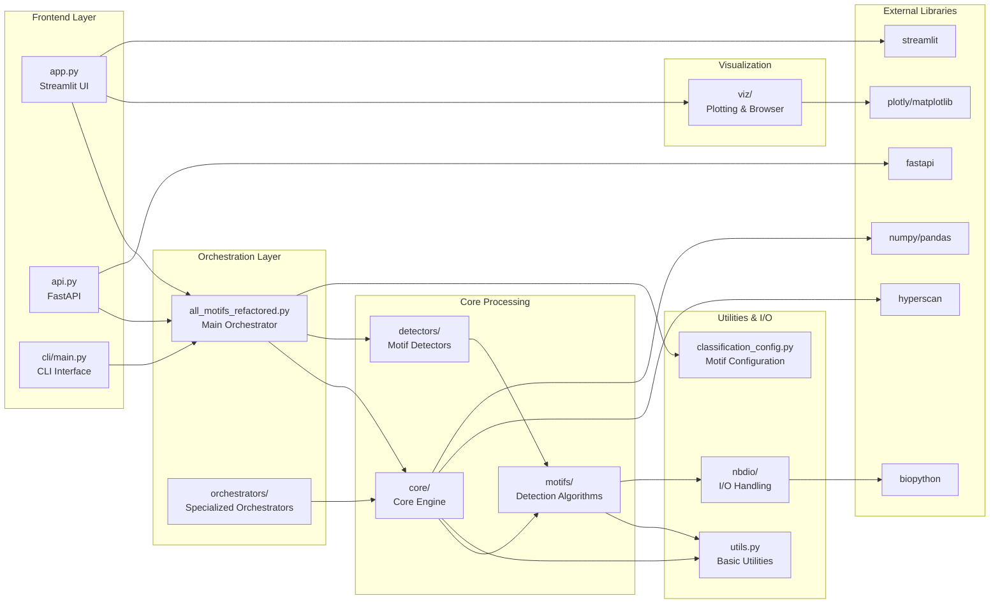
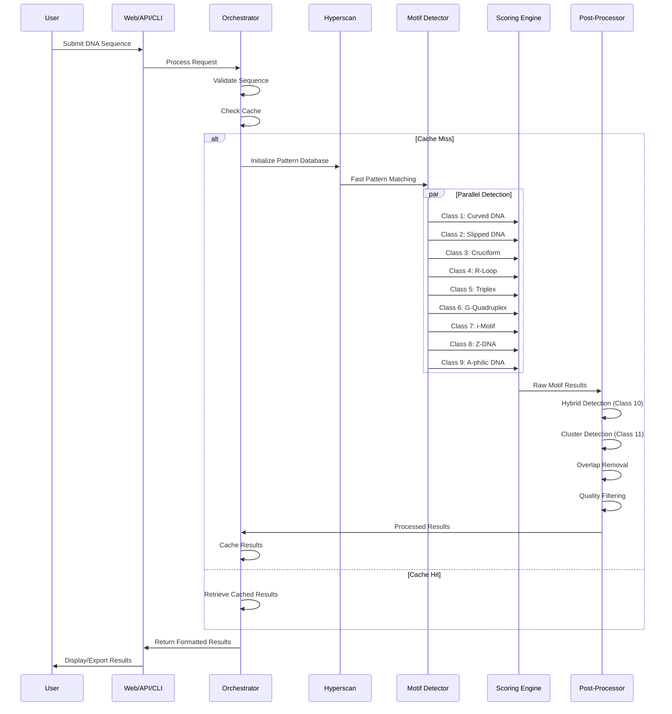
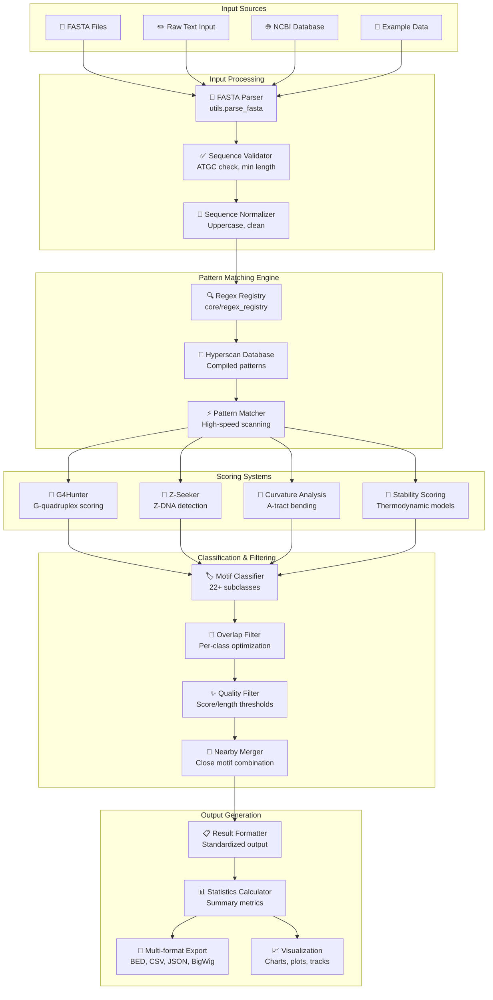

# 🧬 NonBScanner System Architecture & Flow Diagrams

## Overview
NonBScanner (NBDFinder) is a comprehensive Non-B DNA motif detection suite with multi-interface capabilities, high-performance pattern matching, and extensive visualization features.

## 🏗️ Main System Architecture



## 🔄 Core Processing Workflow



## 🏛️ Module Dependencies



## 🎯 Motif Detection Pipeline



## 📊 Data Flow Architecture



## 🌐 API Interaction Flow

```mermaid
graph TB
    subgraph "Client Applications"
        WEBCLIENT[🌐 Web Browser<br/>Streamlit Interface]
        APICLIENT[🔌 API Client<br/>REST requests]
        CURL[💻 cURL/Postman<br/>Direct API calls]
        PYTHON[🐍 Python Scripts<br/>requests library]
    end
    
    subgraph "API Endpoints"
        HEALTH[📊 /api/v1/health<br/>System status]
        CLASSES[📋 /api/v1/classes<br/>Motif class info]
        ANALYZE[🔬 /api/v1/analyze<br/>Full analysis]
        CLASS_ANALYZE[🎯 /api/v1/analyze/{class}<br/>Specific class]
        STATS[📈 /api/v1/stats<br/>Usage statistics]
        DOCS[📚 /docs<br/>API documentation]
    end
    
    subgraph "Middleware & Processing"
        CORS[🔗 CORS Middleware<br/>Cross-origin support]
        AUTH[🔐 Authentication<br/>Optional security]
        RATE[⏱️ Rate Limiting<br/>Traffic control]
        CACHE[💾 Response Cache<br/>Performance boost]
    end
    
    subgraph "Core Processing"
        VALIDATOR_API[✅ Request Validator<br/>Pydantic models]
        ORCHESTRATOR_API[🎯 Analysis Engine<br/>all_motifs_refactored]
        FORMATTER_API[📋 Response Formatter<br/>JSON standardization]
    end
    
    WEBCLIENT --> ANALYZE
    APICLIENT --> ANALYZE
    CURL --> HEALTH
    PYTHON --> CLASS_ANALYZE
    
    HEALTH --> CORS
    CLASSES --> CORS
    ANALYZE --> CORS
    CLASS_ANALYZE --> CORS
    STATS --> CORS
    DOCS --> CORS
    
    CORS --> AUTH
    AUTH --> RATE
    RATE --> CACHE
    
    CACHE --> VALIDATOR_API
    VALIDATOR_API --> ORCHESTRATOR_API
    ORCHESTRATOR_API --> FORMATTER_API
    
    FORMATTER_API --> CACHE
```