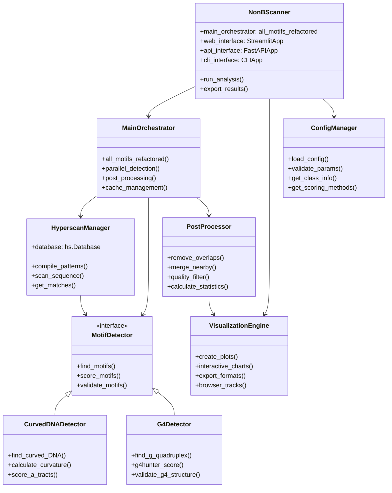
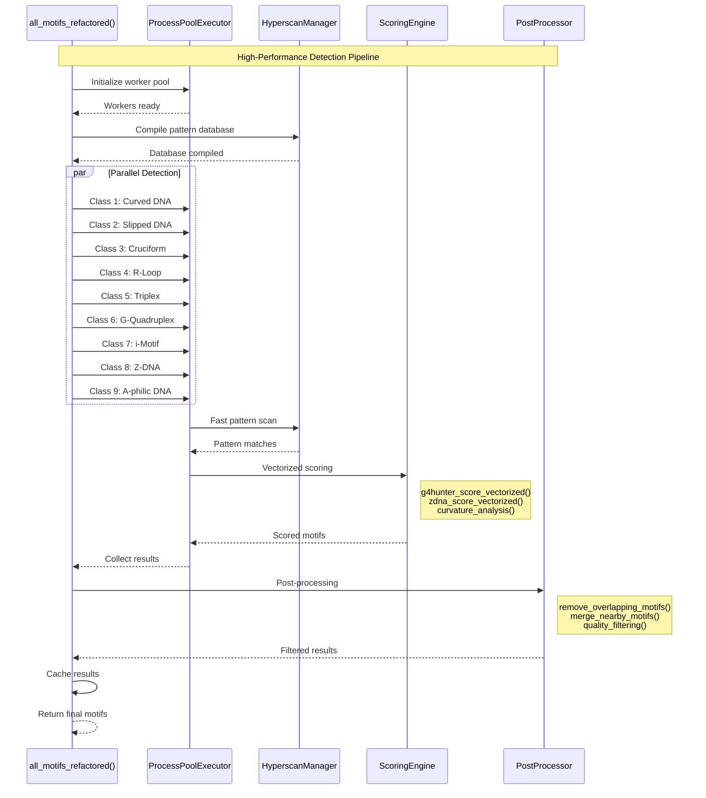
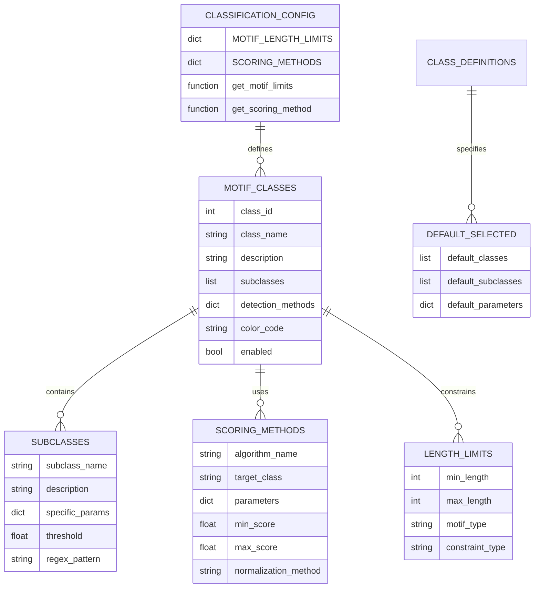

# 🔧 NonBScanner Technical Implementation & Script Analysis

## 📋 File Structure & Script Organization

```mermaid
graph TB
    subgraph "Root Directory"
        ROOT[📁 NonBScanner/]
    end
    
    subgraph "Main Application Files"
        APP[📄 app.py<br/>🌐 Streamlit Web Interface]
        API[📄 api.py<br/>🔌 FastAPI REST Service]
        MAIN_ORCH[📄 all_motifs_refactored.py<br/>🎯 Main Orchestrator]
        UTILS[📄 utils.py<br/>🛠️ Basic Utilities]
        CONFIG[📄 classification_config.py<br/>⚙️ Motif Configuration]
        CLASS_DEF[📄 class_definitions.py<br/>🏷️ Class Definitions]
        MOTIF_CLASS[📄 motif_classification.py<br/>📊 Classification System]
    end
    
    subgraph "Core Processing (core/)"
        CORE_INIT[📄 __init__.py<br/>🎯 Core Module Exports]
        HS_MANAGER[📄 hyperscan_manager.py<br/>🚀 Hyperscan Engine]
        HS_DISPATCHER[📄 hs_dispatcher.py<br/>📡 Pattern Dispatcher]
        REGEX_REG[📄 regex_registry.py<br/>🔍 Pattern Registry]
        SCORING[📄 scoring_simd.py<br/>📊 SIMD Scoring]
        WINDOWS[📄 windows.py<br/>🪟 Sequence Windowing]
        POSTPROCESS[📄 postprocess.py<br/>🎛️ Post-processing]
        CORE_UTILS[📄 utils.py<br/>🛠️ Core Utilities]
        OPT_ORCH[📄 optimized_orchestrator.py<br/>⚡ Optimized Engine]
    end
    
    subgraph "Motif Detectors (motifs/)"
        MOTIF_INIT[📄 __init__.py<br/>🧬 Motif Module Exports]
        BASE_MOTIF[📄 base_motif.py<br/>🏗️ Base Classes]
        CURVED[📄 curved_dna.py<br/>🌊 Curved DNA Detection]
        SLIPPED[📄 slipped_dna.py<br/>🔗 Slipped DNA Detection]
        CRUCIFORM[📄 cruciform_dna.py<br/>✕ Cruciform Detection]
        RLOOP[📄 r_loop.py<br/>🔄 R-Loop Detection]
        TRIPLEX[📄 triplex.py<br/>🔺 Triplex Detection]
        G4[📄 g_quadruplex.py<br/>⭕ G-Quadruplex Detection]
        IMOTIF[📄 i_motif.py<br/>🔵 i-Motif Detection]
        ZDNA[📄 z_dna.py<br/>🌀 Z-DNA Detection]
        APHILIC[📄 a_philic_dna.py<br/>🧬 A-philic DNA Detection]
        HYBRID[📄 hybrid.py<br/>🔀 Hybrid Detection]
        CLUSTER[📄 cluster.py<br/>🌟 Cluster Detection]
        VISUALIZATION[📄 visualization.py<br/>📊 Motif Visualization]
        ENHANCED_VIZ[📄 enhanced_visualization.py<br/>📈 Advanced Plots]
        VIZ_OPT[📄 visualization_optimized.py<br/>⚡ Optimized Plots]
        HS_MANAGER_MOTIF[📄 hyperscan_manager.py<br/>🚀 Motif-specific Hyperscan]
    end
    
    subgraph "Class Detectors (detectors/)"
        DET_INIT[📄 __init__.py<br/>🔍 Detector Registry]
        CLASS01[📄 class01_curved.py<br/>🌊 Class 1 Detector]
        CLASS02[📄 class02_slipped.py<br/>🔗 Class 2 Detector]
        CLASS03[📄 class03_cruciform.py<br/>✕ Class 3 Detector]
        CLASS04[📄 class04_rloop.py<br/>🔄 Class 4 Detector]
        CLASS05[📄 class05_triplex.py<br/>🔺 Class 5 Detector]
        CLASS06[📄 class06_g4_family.py<br/>⭕ Class 6 Detector]
        CLASS07[📄 class07_imotif.py<br/>🔵 Class 7 Detector]
        CLASS08[📄 class08_zdna.py<br/>🌀 Class 8 Detector]
        CLASS09[📄 class09_hybrid.py<br/>🔀 Class 9 Detector]
        CLASS10[📄 class10_cluster.py<br/>🌟 Class 10 Detector]
    end
    
    subgraph "Orchestrators (orchestrators/)"
        ORCH_INIT[📄 __init__.py<br/>🎭 Orchestrator Exports]
        ALL_MOTIFS[📄 all_motifs.py<br/>🎯 Complete Analysis]
        SEPARATED[📄 separated_orchestrator.py<br/>🔀 Separated Analysis]
        STREAM[📄 stream_orchestrator.py<br/>🌊 Streaming Analysis]
    end
    
    subgraph "Visualization (viz/)"
        VIZ_INIT[📄 __init__.py<br/>📊 Viz Module Exports]
        PLOTS[📄 plots.py<br/>📈 Advanced Plotting Suite]
        BROWSER[📄 browser.py<br/>🌍 Genome Browser Integration]
    end
    
    subgraph "I/O Handling (nbdio/)"
        IO_INIT[📄 __init__.py<br/>📁 I/O Module Exports]
        FASTA[📄 fasta.py<br/>🧬 FASTA Parsing]
        WRITERS[📄 writers.py<br/>💾 Output Writers]
        SCHEMAS[📄 schemas.py<br/>📋 Data Schemas]
    end
    
    subgraph "Command Line (cli/)"
        CLI_INIT[📄 __init__.py<br/>💻 CLI Module Exports]
        CLI_MAIN[📄 main.py<br/>🚀 Main CLI Interface]
        SLICE_FASTA[📄 slice_fasta.py<br/>✂️ FASTA Slicing Tool]
    end
    
    ROOT --> APP
    ROOT --> API
    ROOT --> MAIN_ORCH
    ROOT --> UTILS
    ROOT --> CONFIG
    ROOT --> CLASS_DEF
    ROOT --> MOTIF_CLASS
    
    ROOT --> CORE_INIT
    ROOT --> MOTIF_INIT
    ROOT --> DET_INIT
    ROOT --> ORCH_INIT
    ROOT --> VIZ_INIT
    ROOT --> IO_INIT
    ROOT --> CLI_INIT
```



## 🏗️ Key Function & Class Architecture



## ⚡ Key Functions & Libraries Used

```mermaid
mindmap
  root((NonBScanner<br/>Functions & Libraries))
    Core Functions
      all_motifs_refactored()
        ProcessPoolExecutor
        Parallel detection
        Cache management
      parse_fasta()
        BioPython SeqIO
        Sequence validation
        Multi-FASTA support
      hyperscan_scan()
        Intel Hyperscan
        Pattern compilation
        Fast matching
    
    Scoring Functions
      g4hunter_score_vectorized()
        NumPy arrays
        Numba JIT
        SIMD operations
      zdna_score_vectorized()
        Scipy statistics
        Window scoring
        Normalization
      curvature_analysis()
        Mathematical models
        A-tract detection
        Bending prediction
    
    Visualization Functions
      create_all_visualizations()
        Matplotlib
        Plotly
        Seaborn
      plot_motif_distribution()
        Interactive charts
        Color schemes
        Export options
      create_genome_tracks()
        Browser integration
        Track generation
        Format conversion
    
    I/O Functions
      export_to_bed()
        BED format
        Genome coordinates
        Feature annotation
      export_to_bigwig()
        BigWig format
        Signal tracks
        Compression
      export_to_excel()
        OpenPyXL
        Multi-sheet
        Formatting
    
    API Functions
      analyze_sequence()
        FastAPI endpoints
        Pydantic validation
        JSON responses
      health_check()
        System status
        Performance metrics
        Error handling
      get_motif_classes()
        Class information
        Configuration data
        Documentation
    
    CLI Functions
      main_cli()
        Argparse
        Progress bars
        Batch processing
      slice_fasta()
        Sequence slicing
        File handling
        Output formatting
```

## 🚀 Critical Performance Functions



## 📊 Data Structure Flow

```mermaid
graph TD
    subgraph "Input Data Structures"
        SEQ_STR[📄 Sequence String<br/>Raw DNA sequence]
        FASTA_DICT[📁 FASTA Dictionary<br/>{name: sequence}]
        PARAMS_DICT[⚙️ Parameters Dictionary<br/>Analysis configuration]
    end
    
    subgraph "Processing Data Structures"
        MATCH_LIST[🎯 Match List<br/>Hyperscan matches]
        MOTIF_DICT[🧬 Motif Dictionary<br/>Standardized motif data]
        SCORE_ARRAY[📊 Score Array<br/>NumPy vectorized scores]
    end
    
    subgraph "Output Data Structures"
        RESULTS_LIST[📋 Results List<br/>List of motif dictionaries]
        STATS_DICT[📈 Statistics Dictionary<br/>Summary metrics]
        DATAFRAME[📊 Pandas DataFrame<br/>Tabular motif data]
    end
    
    subgraph "Export Data Structures"
        BED_RECORDS[📋 BED Records<br/>Genome coordinates]
        BIGWIG_SIGNAL[📈 BigWig Signal<br/>Score tracks]
        JSON_EXPORT[📄 JSON Export<br/>Structured data]
        EXCEL_SHEETS[📊 Excel Sheets<br/>Multi-format export]
    end
    
    SEQ_STR --> MATCH_LIST
    FASTA_DICT --> MATCH_LIST
    PARAMS_DICT --> MOTIF_DICT
    
    MATCH_LIST --> MOTIF_DICT
    MOTIF_DICT --> SCORE_ARRAY
    
    SCORE_ARRAY --> RESULTS_LIST
    RESULTS_LIST --> STATS_DICT
    RESULTS_LIST --> DATAFRAME
    
    DATAFRAME --> BED_RECORDS
    DATAFRAME --> BIGWIG_SIGNAL
    DATAFRAME --> JSON_EXPORT
    DATAFRAME --> EXCEL_SHEETS
```

## 🔧 Configuration System Architecture



## 🎯 Core Algorithm Implementations

```mermaid
flowchart TD
    subgraph "G4Hunter Algorithm"
        G4_START[🧬 G4Hunter Input<br/>DNA sequence]
        G4_WINDOW[🪟 Sliding Window<br/>Default: 25bp]
        G4_SCORE[📊 G4 Score Calculation<br/>(G_count - C_count) * length]
        G4_NORM[📏 Score Normalization<br/>0-1 range]
        G4_FILTER[🎛️ Threshold Filter<br/>Score >= 1.2]
        G4_OUTPUT[✅ G4 Motifs]
    end
    
    subgraph "Z-DNA Detection"
        Z_START[🌀 Z-DNA Input<br/>DNA sequence]
        Z_PATTERN[🔍 Pattern Matching<br/>Alternating purine-pyrimidine]
        Z_LENGTH[📏 Length Check<br/>Minimum 6bp]
        Z_SCORE[📊 Z-Score Calculation<br/>Statistical model]
        Z_VALIDATE[✅ Structure Validation]
        Z_OUTPUT[✅ Z-DNA Motifs]
    end
    
    subgraph "Curvature Analysis"
        CURVE_START[🌊 Curvature Input<br/>DNA sequence]
        CURVE_ATRACT[🔍 A-tract Detection<br/>AAAA or TTTT runs]
        CURVE_PHASE[📐 Phase Calculation<br/>10.5bp periodicity]
        CURVE_BEND[📊 Bending Angle<br/>Mathematical model]
        CURVE_FILTER[🎛️ Significance Filter]
        CURVE_OUTPUT[✅ Curved DNA Motifs]
    end
    
    G4_START --> G4_WINDOW
    G4_WINDOW --> G4_SCORE
    G4_SCORE --> G4_NORM
    G4_NORM --> G4_FILTER
    G4_FILTER --> G4_OUTPUT
    
    Z_START --> Z_PATTERN
    Z_PATTERN --> Z_LENGTH
    Z_LENGTH --> Z_SCORE
    Z_SCORE --> Z_VALIDATE
    Z_VALIDATE --> Z_OUTPUT
    
    CURVE_START --> CURVE_ATRACT
    CURVE_ATRACT --> CURVE_PHASE
    CURVE_PHASE --> CURVE_BEND
    CURVE_BEND --> CURVE_FILTER
    CURVE_FILTER --> CURVE_OUTPUT
```

This technical documentation provides comprehensive coverage of the NonBScanner implementation details, including file organization, key functions, data structures, and algorithmic approaches.