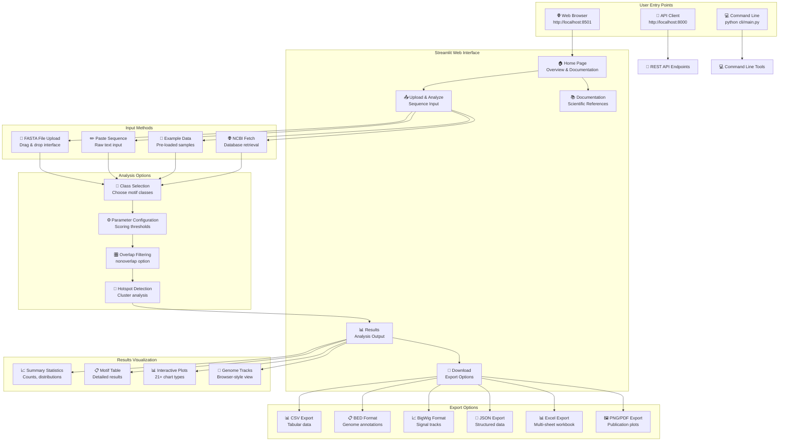
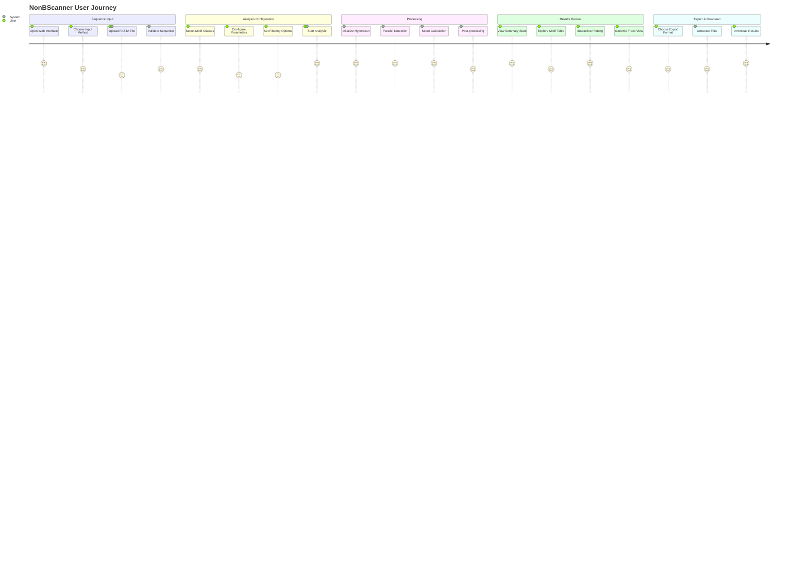
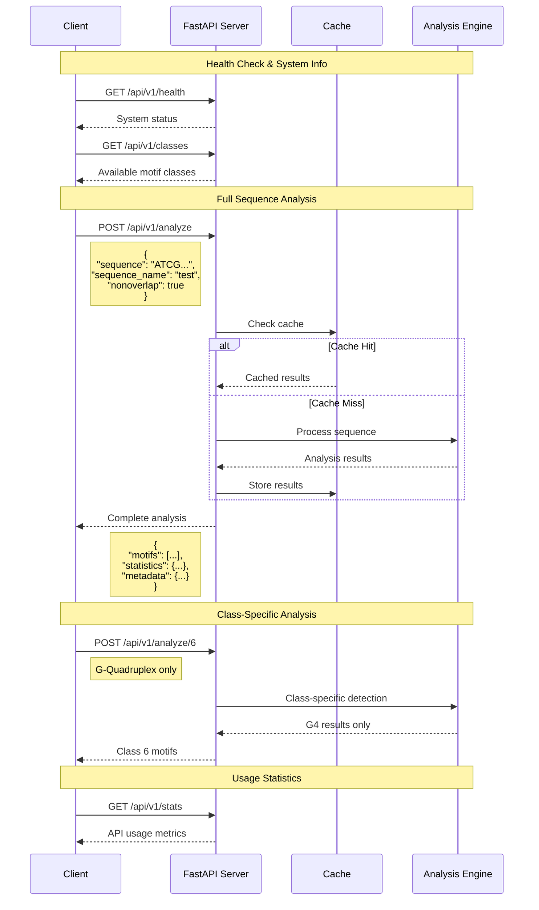
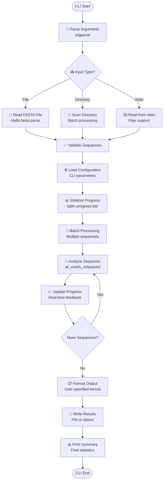
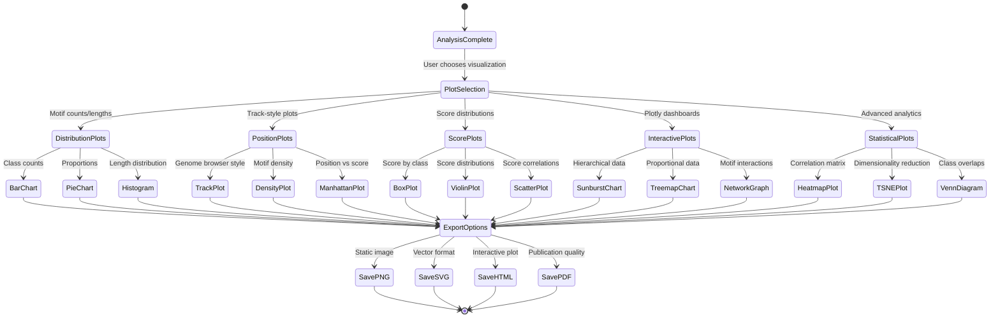
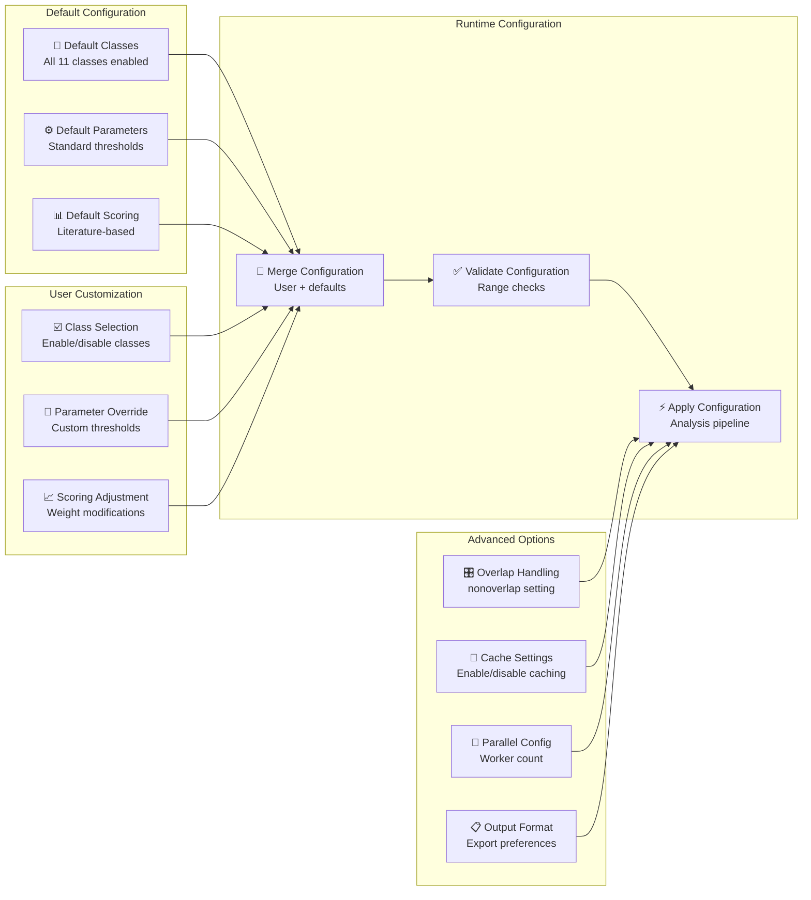
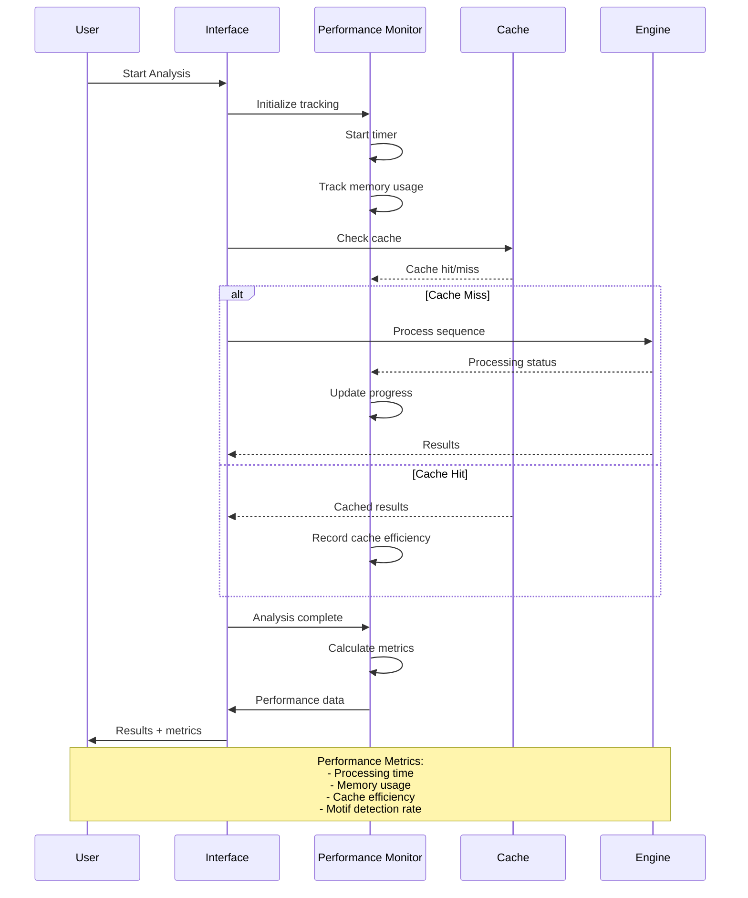

# 🖥️ NonBScanner User Interface & Workflow Diagrams

## 📱 User Interface Overview

## 🔄 Complete User Workflow

## 🌐 API Usage Patterns

## 💻 Command Line Interface Flow

## 📊 Visualization Interface Flow

## 🎛️ Configuration & Parameter Flow

## 🚀 Performance Monitoring Flow

This comprehensive documentation provides detailed visual representations of all user interfaces, workflows, and interaction patterns within the NonBScanner system.